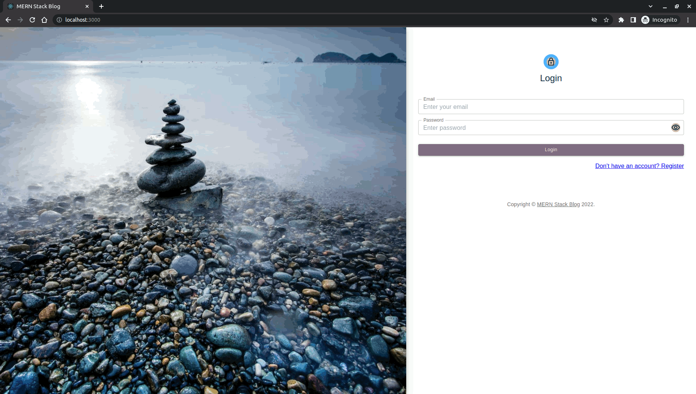

# MERN Stack Blog

## About The Project
---
The purpose of this project is to better understand the steps of making a MERN Stack project. As the name suggests, in this project I used **M**ongoDB, **E**xpress.js, **React.js** and **N**ode.js programs in this project.

### `Packages I use `
#### `Server side`
* bcryptjs
* colors
* dotenv
* express
* jsonwebtoken
* mongoose
* concurrently
* nodemon
#### `Client side`
* @mui/lab
* @mui/material
* axios
* gsap
* react-router-dom
* react-toastify
* react-transition-group
* simplebar-react
* lorem-ipsum

## Installation
---
1. Install the necessary dependencies with npm install.

```sh
npm install
```
2. Create an .env file and fill in the relevant fields shown in the example.
```sh
DATABASE_USERNAME=
DATABASE_PASSWORD=
DATABASE_NAME=
DATABASE_CLUSTER_NAME=
JWT_SECRET=
PORT=
```
3. Go to the **/server** subdirectory and run the following command.

```sh
npm run dev
```
You can go to **http://localhost:3000/** to view the project in browser.

## Preview of the Project
---
